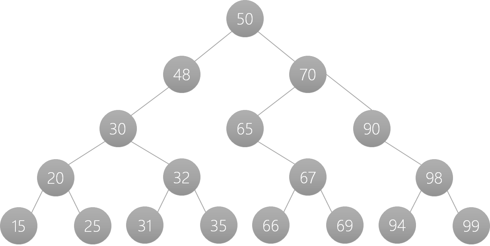

### Binary Tree Traversal

## BFS and DFS

Inorder to solve a binary trees question, we first need to traverse them. We have two technique of traversal in binary tree viz. Breadth-First Search technique and Depth-First Search technique.

First of all lets first understand the concept of Depth-First search for this tree. And at last, we will also solve a traversal challenge.

## DFS - (Depth First Search)

There are basically three types of depth first search technique. 

- Inorder Traversal (Left-Root-Right)
  
  Order for the traversal: 5 2 6 4 9 3 11 

- Preorder Traversal (Root-Left-Right)
  
  Order of the traversal: 4 2 5 6 3 9 11

- Postorder Traversal (Left-Right-Root)
  
  Order of the traversal: 5 6  2 9 11 3 4 

### How to remember DFS traversal sequence ?

To remember dfs sequence we have a little trick. 
> In (root in the middle )
> Pre (root in the beginning)
  >Post (root at the last)
>and left always comes before right

## BFS

Breadth First Search sequence is easy to remember.

For the given binary tree the sequence is :

4 2 3 5 6 9 11

> left->right

## Traversal  challenge

Lets solve dfs traversal order for this tree. 

- Inorder Traversal (Left-Root-Right)
  
  Order for the traversal: 15 20 25 30 31 32 35 48 50 66 67 69 65 70 90 94 98 99 

- Preorder Traversal (Root-Left-Right)
  
  Order for the traversal: 50 48 30 20 15 25 32 31 35 70 65 67 66 69 90 98 94 99

- Postorder Traversal (Left-Right-Root)
  Order for the traversal: 15 25 20 31 35 32 30 48 66 69 67 65 94 99 98 90 70 50

